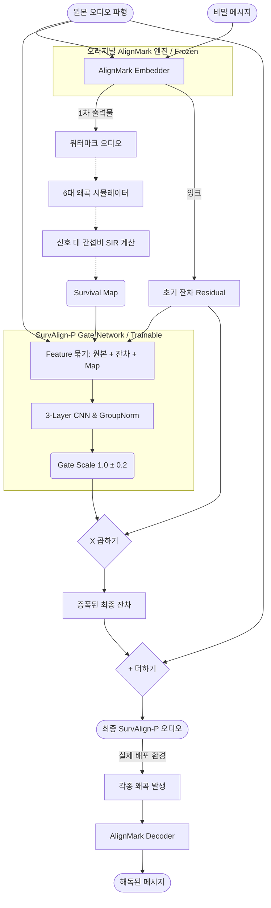
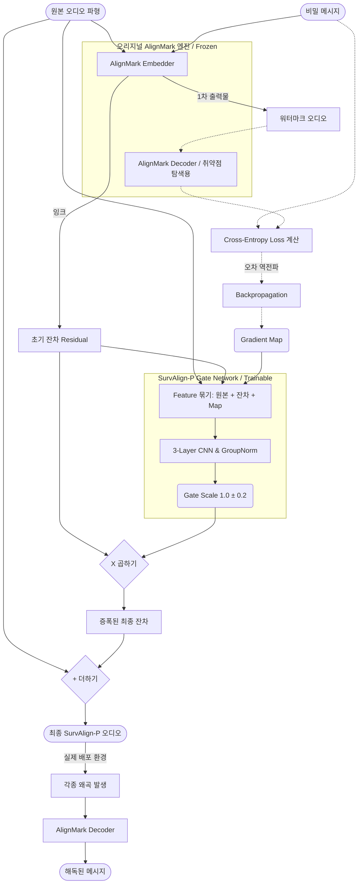

# SurvAlign-P 모델 세부 아키텍처 (Model Architectures)

> [!NOTE]
> 본 문서는 두 가지 제안 기법(후보군)인 **Survival Map 기반 아키텍처**와 **Gradient Map 기반 아키텍처**의 내부 데이터 흐름(Data Flow)을 도식화한 것입니다. 논문의 모델 구조도(Figure)를 그리실 때 이 다이어그램을 참고하시면 매우 유용합니다.

---

## 1. Candidate A: Survival Map 기반 아키텍처
**핵심 철학**: "물리적으로 시끄러운 환경(왜곡)을 거친 뒤에도 씻겨 내려가지 않는 주파수 대역을 칠하자."

---

## 2. Candidate B: Gradient Map 기반 아키텍처
**핵심 철학**: "디코더 인공지능이 메시지를 읽을 때 역전파(Backprop) 수치가 크게 요동치는, 즉 수학적으로 가장 민감한 취약점 대역을 칠하자."

---

### 💡 두 아키텍처의 결정적 차이점 비교
위 흐름도를 보시면 두 모델의 차이는 오직 **"Feature Pack(특징 묶음)에 세 번째 재료로 무엇을 넣어주는가?"**에 있습니다.

* **Candidate A (Survival)**: 왜곡 시뮬레이터(`DistSim`)를 통과시켜 살아남는 소리의 크기를 계산한 물리적인 지도(`Survival Map`)를 넣습니다. 디코더를 미리 열어보지 않고 순수하게 물리 법칙에 의존합니다.
* **Candidate B (Gradient)**: 디코더(`AM_Dec_Probe`)에 오디오를 한 번 넣어본 뒤, 디코더가 아파하는 수학적 미분값(`Gradient Map`)을 역으로 추적하여 넣습니다. 인공지능의 내부 취약점 공략에 의존합니다.

나머지 부분, 즉 **AlignMark의 출력을 가로채서 3-Layer CNN을 통해 곱해준 뒤(X) 더해서(+) 내보낸다**는 핵심 매커니즘은 두 아키텍처 모두 완벽하게 동일합니다!
